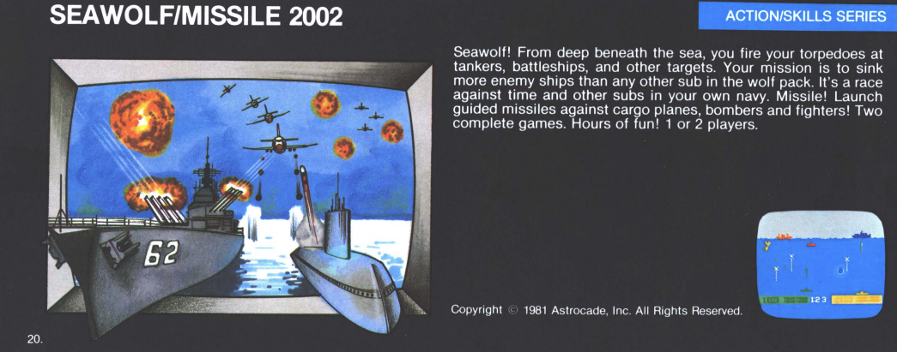
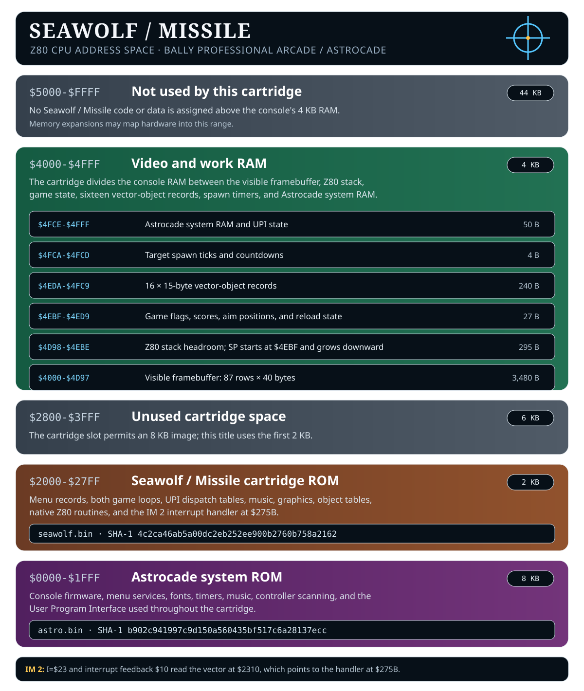

# Seawolf / Missile

This project is a byte-exact reconstruction and documented disassembly of **Seawolf / Missile** Dave Nutting Associates (DNA) game developed by Rick Spiece published by Bally in 1978 for the Bally Professional Arcade / Astrocade.

This project builds upon the disassembly work of Adam Trionfo's 2011 v0.002



|  |  |
| --- | --- |
| Cartridge ROM | 2 KB at `$2000-$27FF` |
| Assembler | Bruce Norskog's zmac 1.3 |
| ROM identity | SHA-1 `4c2ca46ab5a00dc2eb252ee900b2760b758a2162` |
| MAME package | `roms/astrocde.zip` |

## The two games

**Seawolf** puts each player in control of a submarine. The controller knob moves the submarine and the trigger fires a torpedo. Four torpedoes are loaded at a time; firing all four starts a four-second reload. Tankers score 10 points, battleships score 30, and P.T. boats score 50. Floating mines intercept torpedoes.

**Missile** uses the knob to move a ground launcher. The trigger launches a missile and the joystick steers it left or right after launch. Targets are cargo planes, bombers, and fighters.

 Bally originally published the two-in-one combat shooter package as Sea Wolf / Missile in 1977. When they re-issued the cartridge under a fresh production batch, they retitled it to Sea Wolf / Bombardier.
 Because the Bombardier variant was printed in much smaller quantities later in the console's life cycle, it is significantly rarer and more sought after by collectors than the standard Missile labeled cartridge

## Project layout

| Path | Contents |
| --- | --- |
| `src/Seawolf.asm` | Reconstructed and annotated cartridge source |
| `src/HVGLIB.H` | Astrocade system equates and User Program Interface macros |
| `src/zout/` | Generated `seawolf.bin` and `seawolf.lst` |
| `build.sh` | Linux build, verification, and MAME packaging script |
| `build.bat` | Windows build, verification, and MAME packaging script |
| `tools/zmac` | Bundled Linux zmac 1.3 executable |
| `tools/zmac.exe` | Bundled Windows zmac 1.3 executable |
| `roms/original/astro.bin` | User-supplied Astrocade system ROM |
| `roms/astrocde.zip` | Generated merged MAME test package |
| `docs/` | Original manual and technical references |
| `images/` | Cartridge, catalog, and memory-map images |

`src/zout/` and `roms/astrocde.zip` are generated outputs. The source and
reference material remain separate from the build products.

## ROM organization

| Address | Contents |
| ---: | --- |
| `$2000-$200C` | User-cartridge sentinel and two menu records |
| `$200D-$204D` | Missile and Seawolf entry points and UPI event loops |
| `$204E-$22D5` | Initialization, controller handlers, object allocation, and UPI dispatch tables |
| `$22D6-$2317` | Music streams, Missile object pointers, and the IM 2 vector word |
| `$2318-$2424` | Coordinates, palettes, text, sound values, patterns, and vector templates |
| `$2425-$275A` | Reloads, spawning, collision, scoring, object movement, and explosion handling |
| `$275B-$27FF` | IM 2 interrupt handler, Missile steering, and projectile allocation |



## Code architecture

### Astrocade User Program Interface

The cartridge relies on the Astrocade system ROM for menus, controller
scanning, timers, text, patterns, vector movement, screen clearing, score
display, and music. `HVGLIB.H` supplies the equates and macros used to encode
these calls.

Both games follow the same foreground structure:

1. The cartridge menu enters `START_SEAWOLF` or `START_MISSILE`.
2. `INITIALIZE_GAME` reads the time parameter, clears display and work RAM,
   initializes counters, and installs the interrupt vector.
3. `SENTRY` watches controller changes, counter expirations, flags, and the
   one-second timer.
4. `DOIT` dispatches common events and then the table for the selected game.
5. `MJUMP` returns to the game's event loop.

`SEAWOLF_DOIT_TABLE`, `MISSILE_DOIT_TABLE`, and `COMMON_DOIT_TABLE` expose the
complete foreground event routing in the source.

### IM 2 interrupt path

Initialization sets `I=$23`, writes `$10` to the interrupt-feedback port, and
selects Z80 interrupt mode 2. The resulting vector lookup reads the word at
`$2310`, which points to `INTERRUPT_HANDLER` at `$275B`.

The interrupt handler alternates between two object cursors and performs the
runtime work in short pieces:

- update one active vector object;
- service both reload timers;
- advance both target-spawn timers;
- select the next object for the following interrupt;
- advance the object timers used by the vector pool.

This keeps object movement, collision state, reload timing, and target spawning
running while the foreground UPI loop handles input events and score display.

### Vector-object pool

The game stores sixteen 15-byte vector records at `$4EDA-$4FC9`. Each record
uses the standard Astrocade vector layout defined by `VBMR` through `VBOAH` in
`HVGLIB.H`.

| Records | RAM | Use |
| ---: | ---: | --- |
| 0-3 | `$4EDA-$4F15` | Two pairs used by the target-spawn handlers |
| 4, 6, 8, 10 | `$4F16`, `$4F34`, `$4F52`, `$4F70` | Player-one projectile slots |
| 5, 7, 9, 11 | `$4F25`, `$4F43`, `$4F61`, `$4F7F` | Player-two projectile slots |
| 12-15 | `$4F8E-$4FC9` | Target and aircraft collision pool |

Projectile allocation advances by 30 bytes, so each player receives every
other record. Target allocation advances by 15 bytes through adjacent pairs.

### Graphics, sound, and scoring

The ROM contains separate object-pointer tables for the two games. Seawolf
selects torpedo, mine, tanker, battleship, and P.T. boat patterns. Missile
selects explosion, cargo plane, bomber, and fighter patterns. The source names
the draw-data prefixes as well as the pattern headers they precede.

The graphics region also contains both four-color palettes, the player
submarine and launcher, torpedo indicators, explosion frames, two music
streams, and three eight-byte Missile sound-register sets. Seawolf scoring is
packed BCD; target types 2, 3, and 4 convert directly to 10, 30, and 50 points.

### Shared and overlapping bytes

The original ROM saves space by assigning more than one purpose to several
byte sequences. Version 0.003 preserves and labels these layouts:

- The SF4 handler at `$209E` begins inside the SF3 path's `LD HL` instruction.
- The player-two trigger handler at `$2227` begins inside an `LD IX` instruction.
- The alternate explosion path at `$26D0` begins inside an `LD IY` instruction.
- The word at `$2310` is both an unused Missile object-table entry and the IM 2
  vector pointing to `$275B`.
- Text terminators and final pattern rows also serve as two-byte draw-data
  prefixes for adjacent objects.

These overlaps are intentional parts of the original 2 KB image. The source
expresses them without changing the assembled bytes.

## Build

Both scripts use the bundled zmac 1.3 assembler. 

Linux:

```sh
./build.sh
```

Windows 10/11:

```bat
build.bat
```

Each script performs the same three steps:

1. Assemble `src/Seawolf.asm` into `src/zout/seawolf.bin` and
   `src/zout/seawolf.lst`.
2. Verify the generated cartridge and `astro.bin` against their required SHA-1
   values. A mismatch stops the build.
3. Create `roms/astrocde.zip` in MAME's merged software-list layout.

**NOTE** A 'normal" mame zip would be seawolf.zip but that would have a dependancy on astrocde.bin. To make testing easier, we bundle into a special ready-to-run mame astrocde.zip

Generated files:

```text
src/zout/seawolf.bin
src/zout/seawolf.lst
roms/astrocde.zip
```

ROM SHA-1:

```text
b902c941997c9d150a560435bf517c6a28137ecc
```

The archive contains:

```text
astro.bin
seawolf/seawolf.bin
```

## Run in MAME

From the project directory:

```sh
mame astrocde -window -cart seawolf -rompath roms
```

MAME opens `roms/astrocde.zip`, loads `astro.bin`, and then loads
`seawolf/seawolf.bin` for the selected cartridge.


## Credits

- Rick Spiece — original game programmer, as credited by the Astrovision manual
- Adam Trionfo — v0.001 and v0.002 disassembly
- Richard C. Degler, Adam Trionfo, and Lance F. Squire — `HVGLIB.H` history,
  transcription
